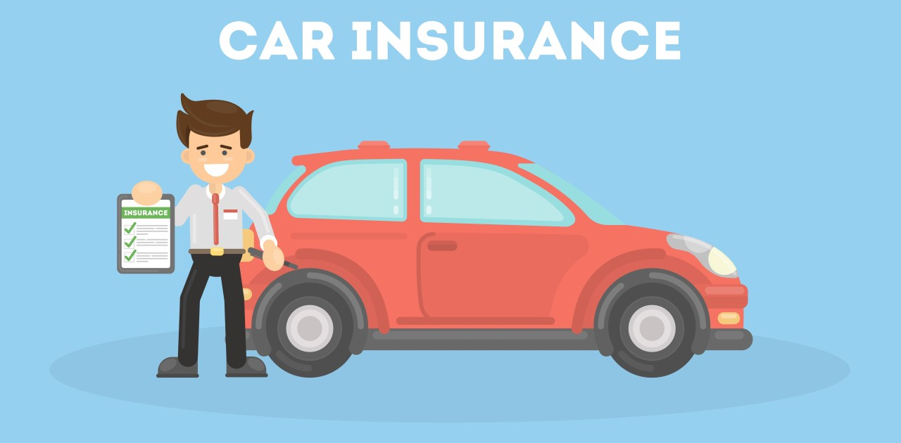
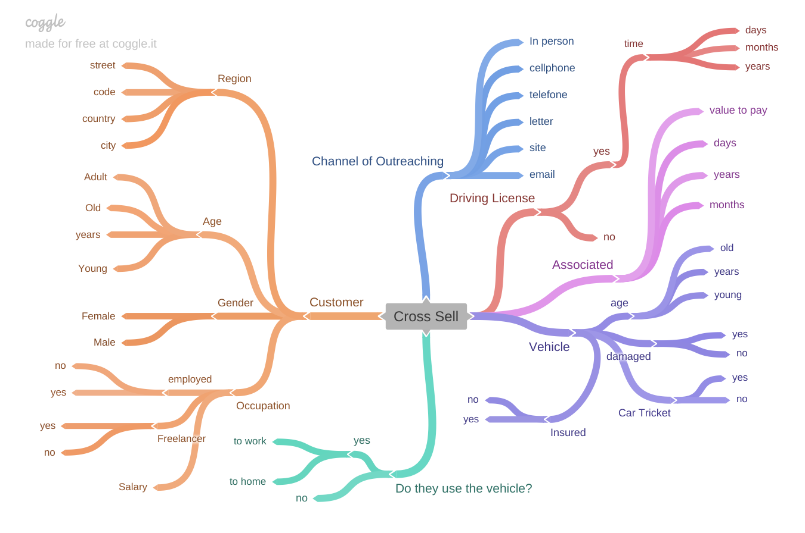
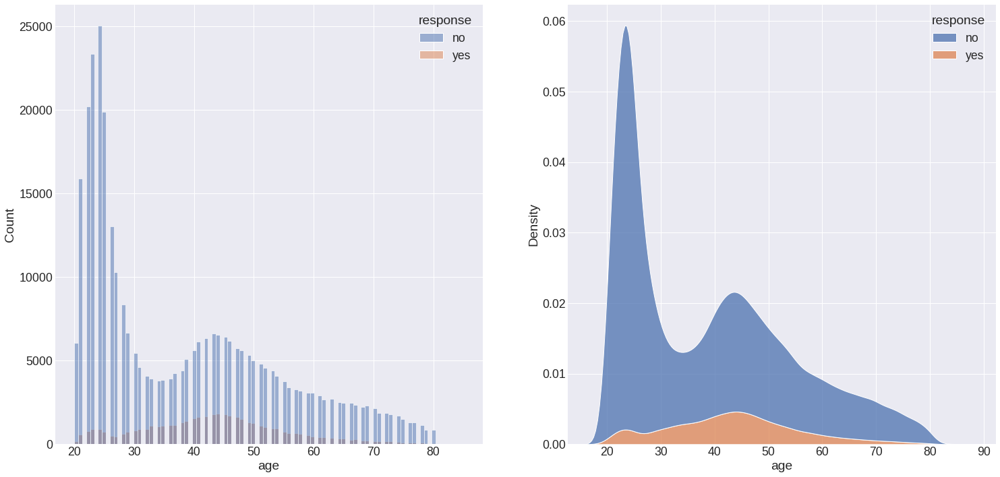
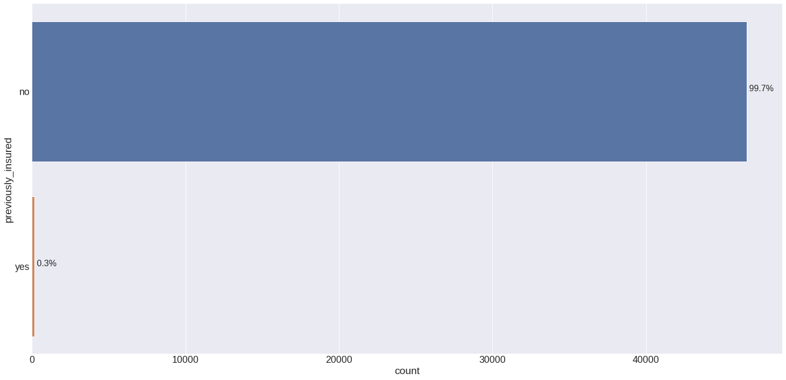
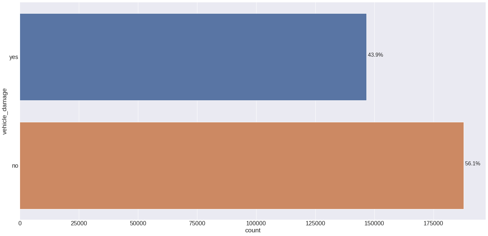
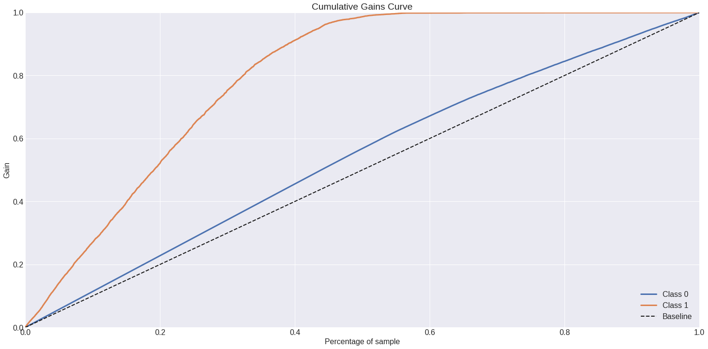
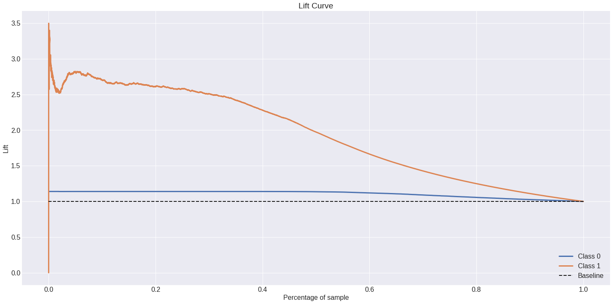

# Vehicle Insurance Cross-Sell 

    

### This project aims to order a potential client list by propensity score.
---
# 1.0 Business Problem

<<<<<<< HEAD
Insurance All is a company that provides Vehicle insurance to its customers and the product team is analyzing the possibility of offering policyholders a new product: Vehicle insurance.

As with Vehicle insurance, customers of this new Vehicle insurance plan need to pay an amount annually to Insurance All to obtain an amount insured by the company, intended for the costs of an eventual accident or damage to the vehicle.
=======
Insurance All is a company that provides Health Insurance to its customers and the product team is analyzing the possibility of offering policyholders a new product: Vehicle Insurance.

As with health insurance, customers of this new Vehicle insurance plan need to pay an amount annually to Insurance All to obtain an amount insured by the company, intended for the costs of an eventual accident or damage to the vehicle.
>>>>>>> 0d38865e6f61998ec9d16e72934a4d77fc7c8417

Insurance All conducted a survey of about 380,000 customers about their interest in joining a new Vehicle insurance product last year. All customers expressed interest or not in purchasing Vehicle insurance and these responses were saved in a database along with other customer attributes.

The product team selected 127 thousand new customers who did not respond to the survey to participate in a campaign, in which they will receive the offer of the new Vehicle insurance product. The offer will be made by the sales team through telephone calls.

However, the sales team has the capacity to make 20 thousand calls within the campaign period.

---
# 2.0 Business Assumptions

**Cross sell** is a technique to offer of a product complementary to what the customer has decided to buy to increase the store's revenue. Therefore, it's important to notice 2 points: the customer and the product.

[Harvard Business Review](https://hbr.org/2012/12/the-dark-side-of-cross-selling) conducted a research with several companies in Europe and the United States, finding that all those that implemented cross sell strategies increased the ROI (Return on Investiment) obtained from each client.

The **Cross Sell** may also increase **Average Ticket Price**. This metric is important to find out how much each customer spends on their products and services.

---
# 3.0 Solution Strategy

My solution to solve this problem will be the development of a data science project. This project will have a machine learning model which can predict customers that may be interested in Vehicle insurance. It'll help the team to selct the best customers that may be interested in Vehicle insurance.

**Step 01. Data Description:** In this first section the data will be collected and studied. The missing values will be threated or removed. Finally, a initial data description will carried out to know the data. Therefore some calculations of descriptive statistics will be made, such as kurtosis, skewness, media, fashion, median and standard desviation.

**Step 02. Feature Engineering:** In this section, a mind map will be created to assist the creation of the hypothesis and the creation of new features. These assumptions will help in exploratory data analysis and may improve the model scores.

### MIND MAP

    
    

### ***HYPOTHESIS CREATION***

**- Customer:**
* More than 60% of customers who want Vehicle insurance are women.
* Young people account for less than 30% of custumers who want Vehicle insurance.
* The older the customer, greater is the possibility of wanting Vehicle insurance.
* Employers account for more than 75% or more of customers who want Vehicle insurance.
* The high-salary ccustomers are more likely to get Vehicle insurance.

**- Vehicle:**
* Customers with car insurance are more lilkely to get Vehicle insurance.
60% or more of the customers with two-year-old vehicle are more likely to pay for Vehicle insurance.
* Less than 40% of customers who have damaged the vehicle don't want to get the Vehicle insurance.
* Customers who use the car to work are more likely to get Vehicle insurance.
* Customers with car ticket aren't more likely to get Vehicle insurance.
Womens is 40% or less of the curstomers with car ticket.

**- Driving License:**  
* Most customers are licensed to drive.
* Customers with two or more years licensed to drive are more likely to get Vehicle insurance.
* Customers with more one year or more licensed to drive have car ticket.
60% or more of the curstomers with one or more years of driving lincense have vehicle damages.
* The older is the vehicle, more likely the customers have a car ticket.

**- Associated:**
* Older customers are more likely to pay less for the annual Vehicle insurance.
* 70% or more of the customers with car insurance are more likely to get Vehicle insurance.
* Older customers and those which pay more for annual Vehicle insurance are more likely to get Vehicle insurance.
* 60% or more of the associated customers don't have car ticket.
* 70% or less of the associated customers are women.
* More than 60% of the associated customers are more likely to get Vehicle insurance.
* The more associated, more likely they may get the Vehicle insurance.

**- Channel of Outreaching:**
* 60% or more of the customers contacted by email are younger than 40 years.
* 75% or less of the telefone catacted customers are more likely to get Vehicle insurance.
* The most channel used to contact was the website advertisement for Vehicle insurance.
* 80% or more of the customers contacted by telefone are older than 60 years old.

**- Selected Hypothesis:**
* More than 60% of customers who want Vehicle insurance are women.
* Young people account for less than 30% of custumers who want Vehicle insurance.
* The older the customer, greater is the possibility of wanting Vehicle insurance.
* Customers with car insurance are more lilkely to get Vehicle insurance.
* 60% or more of the customers with two-year-old vehicle are more likely to pay for Vehicle insurance.
* Less than 40% of customers who have damaged the vehicle don't want to get the Vehicle insurance.
* Older customers and those which pay more for annual Vehicle insurance are more likely to get Vehicle insurance.
* The more associated, more likely they may get the Vehicle insurance.

**Step 03. Data Filtering:** Data filtering is used to remove columns or rows that are not part of the business. For example, columns with customer ID, hash code or rows with age that does not consist of human age.

**Step 04. Exploratory Data Analysis:** The exploratory data analysis section consists of univariate analysis, bivariate analysis and multivariate analysis to assist in understanding of the database. The hypothesis created in step 02 will be tested in the bivariate analysis.

**Step 05. Data Preparation:** In this fifth section, the data will be prepared for machine learning modeling. Therefore, they will be transformed to improve the learning of the machine learning model, thus they can be encoded, oversampled, subsampled or rescaled.

**Step 06. Feature Selection:** After the data preparation in this section algorithms, like Boruta, will select the best columns to be used for the training of the machine learning model. This reduces the dimensionality of the database and decreases the chances of overfiting.

**Step 07. Machine Learning Modeling:** Step 07 aims to train the machine learning algorithms and how they can predict the data. For validation the model is trained, validated and applied to cross validation to know the learning capacity of the model.

**Step 08. Hyparameter Fine Tuning:** Firstly selected the best model to be applied in the project, it's important to make a fine tuning of the parameters to improve its scores. The same model performance methods apllied in the step 07 are used.

**Step 09. Conclusions:** This is a conclusion stage which the generation capacity model is tested using unseen data. In addition, some business questions are answered to show the applicability of the model in the business context.

**Step 10. Model Deploy:** This is the final step of the data science project. So, in this step the flask api is created and the model and the functions are saved to be implemented in the api.

---
# 4.0 Top 3 Data Insights

* #### The older the customer, greater is the possibility of wanting Vehicle insurance.
    **False:** People between 40 and 50 are more interested in having Vehicle insurance.

    

* #### Customers with car insurance are more lilkely to get Vehicle insurance.

    **False:** Customers without car insurance are more likely to get Vehicle insurance. In this database 99.7% of customers are previously insured.

    

* #### Less than 40% of customers who have damaged the vehicle don't want to get the Vehicle insurance.

    **False:** Customers who don't want the Vehicle insurance and got damaged are about 43.9%.

    

---
# 5.0 Machine Learning Applied

Here's all cross validation results of the machine learning models with their default parameters. These metrics corresponds to a k = 50%, up to 50% of data. The cross validation method is important to show the capacity of the model to learn. 

#### Dummy Model

|  Top K Precision  |    Top K Recall   |   Top K F1-Score  |
|:-----------------:|:-----------------:|:-----------------:|
| 0.1231 +/- 0.0015 | 0.5021 +/- 0.0059 | 0.1977 +/- 0.0023 |

#### Logistic Regression

|  Top K Precision  |    Top K Recall   |   Top K F1-Score  |
|:-----------------:|:-----------------:|:-----------------:|
| 0.242 +/- 0.0002  | 0.9874 +/- 0.0009 | 0.3888 +/- 0.0003 |

#### Random Forest

|  Top K Precision  |    Top K Recall   |   Top K F1-Score  |
|:-----------------:|:-----------------:|:-----------------:|
| 0.2406 +/- 0.0003 | 0.9816 +/- 0.0014 | 0.3865 +/- 0.0005 |

#### Extra Trees

|  Top K Precision  |    Top K Recall   |   Top K F1-Score  |
|:-----------------:|:-----------------:|:-----------------:|
| 0.2406 +/- 0.0004 | 0.9815 +/- 0.0017 | 0.3864 +/- 0.0006 |

#### XGBoost

|  Top K Precision |    Top K Recall   |   Top K F1-Score  |
|:-----------------:|:-----------------:|:-----------------:|
| 0.2415 +/- 0.0006 | 0.9851 +/- 0.0024 | 0.3879 +/- 0.001  |

#### LightGBM

|  Top K Precision  |    Top K Recall   |   Top K F1-Score  |
|:-----------------:|:-----------------:|:-----------------:|
| 0.2417 +/- 0.0002 | 0.9861 +/- 0.0009 | 0.3883 +/- 0.0003 |

---
# 6.0 Machine Learning Performance

The chosen model was **Logistic Regression** and it was tuned to improve their parameters and scores. Below there's a table with the capacity of the model to learn.

|  Top K Precision  |    Top K Recall   |   Top K F1-Score  |
|:-----------------:|:-----------------:|:-----------------:|
| 0.241 +/- 0.0004  | 0.9831 +/- 0.0016 | 0.3871 +/- 0.0006 |

It's possible to determinize the capacity of the model to generalize using unseen data. In other words, capcity of the model to classify new data as shown.

|  Top K Precision  |    Top K Recall   |   Top K F1-Score  |
|:-----------------:|:-----------------:|:-----------------:|
| 0.2793  | 0.9115 | 0.4275 |

These graphs below show the accumulative gain and lift curve.

---
# 7.0 Business Results

* #### What percentage of customers are interested in purchasing auto insurance? Will the sales team be able to reach them by making 20,000 calls?

    1. The database is based on 46,876 (12.3%) of customers interessed in Vehicle insurance and 334,232 (87.7%) of no interested.

    1. The model results have shown that the model has the precision of 24.10% (24.14% for a excellent performance or 24.06% for a poor performance). So, using the model it's possible to contact 4,820 (4,828 for a excellent performance or 4,812 for a poor performance) customers interested in Vehicle insurance of 20,000 calls. However the recall is about 98.31% (+/- 0.0016).

* #### If the sales team's capacity increases to 40,000 calls, what percentage of customers interested in purchasing auto insurance will the sales team be able to contact?

    Increasing to 40,000 calls the model may help the sales team to contact 9,640 (9,656 for a excellent performance or 9,624 for a poor performance) the customers interested in Vehicle insurance.

* #### How many calls does the sales team need to make to contact 80% of customers interested in purchasing auto insurance?

    The model sorted 98.31% (46,084 customers) of the customer interested in 50% of the database with 381,109 customers. Using the model, it's possible to contact 80% of customers interested in Vehicle insurance in 155,064 (155,064 for a excellent performance or 155,064 for a poor performance) calls.

---
# 8.0 Conclusions

The random model classified correctly just 12.31% (+/- 0.15%) of the interested customer. The final model has the ability to differentiate the classes and managed to correctly classify 24.1% (+/- 0.04%). The **lift curve** also shows that the model manages to have a gain 3 times greater than the random choice of customers. 

The model was able to organize that almost all interested customers (98.31% +/- 0.16%) stay on up to 50% of the sorted list. This makes it possible to save half of the expenses incurred for calls. So if each call costs R\$ 15.00 in 20,000.00 there is an expense of R\$ 300,000.00. Using the model it is possible to spend only R\$ 150,000.00.

---
# 9.0 Next Steps

* Improvement of the model's metrics, espeacilly the precision.

* Test other hypothesis to get new insights from the database.

